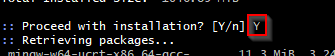
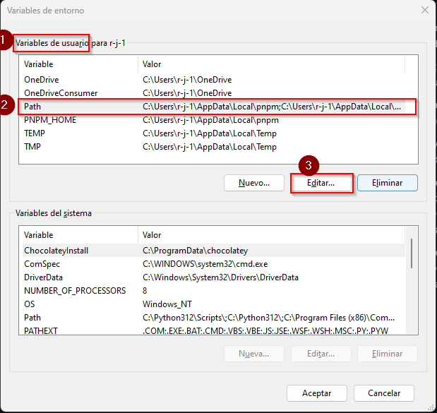

# Instalation:

Hi, In this lesson you wil learn how to install your **`C++`** enviroment in Visual Studio Code.

> [!WARNING]
> VS Code is just a Code Editor, there are many options you can choose and some of them could be even better, you can use the enviroment you want.

## Instructions:

### VS Code:
1. In this class we will be using [`VS Code`](https://code.visualstudio.com/Download) (Visual Studio Code), so the first step is to download it based on your OS.

2. Once installed, please open the application.
    At the side of the screen you will see a bar with various icons like this:

    

    And select the one with the red square shown in the image.

3. Now we should install a extension which will help us to process the language and have some help while programming.
    1. In the search bar write `C++`, and some extension will be displayed just below.
    2. Select the one that says `C/C++`. As shown in the image below.
    3. Click on the `install` button.

    

4. Once you have it installed, you must close and reopen your `VS Code`.

### Compiler:

1. To be able to compile our programs we will need the corresponding compilers. We will be using `MSYS2` as compiler. Please download the installer in the next link [MSYS2 Installer](https://github.com/msys2/msys2-installer/releases/download/2023-05-26/msys2-x86_64-20230526.exe) and execute it.

2. In the installer you can just click on all `Next`/ `Accept` buttons.

    > [!NOTE]
    > On the last you make sure to check the square to open the installer once is installed.
    >
    > If you didn´t check the square and clicked next. Search for the `MSYS2` app in computer.

3. In this terminal you should paste the next command.

    > [!TIP]
    > Note that you could have some problems using your keyboard to paste the command. 
    >
    > Instead of using your keyboard, use the right click of your mouse and then select paste. 

    ```sh
    pacman -S --needed base-devel mingw-w64-ucrt-x86_64-toolchain
    ```

    > [!CAUTION]
    > The process will start, and at some point you will be asked to `Enter a selection`. In this part you should just **`Press Enter`**.
    >
    > 

    > [!CAUTION]
    > Later you will be asked to proceed, please write **`Y`** and **`Press Enter`**
    >
    > 

4. Once you the instalation end, we will need to edit our enviroment variables to be able to use the corresponding commands.
    
    1. In the *Windows search bar*, type `Settings` to open your Windows Settings.
    
    2. Search for **`Edit environment variables`** for your account.
    
    3. In your **`User variables`**, select the **`Path`** variable (it must be in blue) and then select **`Edit`**.
    

    4. Select `New` and add the MinGW-w64 destination folder you recorded during the installation process to the list. If you used the default settings above, then this will be the path: `C:\msys64\ucrt64\bin.`
    

    5. Select `OK` to save the updated PATH. You will need to reopen any console windows for the new PATH location to be available

5. To check the correct instalation of our compiler please open a new terminal and paste the next commands.

    ```sh
        gcc --version
        g++ --version
        gdb --version
    ```
    > [!NOTE]
    > You should see a some information displayed. 
    >
    > If you see an error there is something wrong. Please raise your hand or send me a message, I´ll help you without a problem.